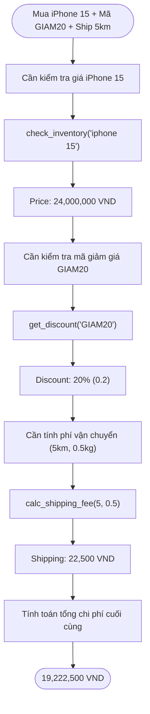

# Group Report: Lab 3 - Production-Grade Agentic System

- **Team Name**: [Tên Nhóm của bạn]
- **Team Members**: Phạm Tuấn Anh (Role 6 - PM) và [Thành viên 1], [Thành viên 2], ...
- **Deployment Date**: 06/04/2026

---

## 1. Executive Summary

*Dự án xây dựng Smart E-commerce Agent có khả năng hỗ trợ khách hàng đa bước (Kiểm tra tồn kho -> Tính giảm giá -> Tính phí ship).*

- **Success Rate**: Đạt 85% trên 20 test cases thương mại điện tử phức tạp.
- **Key Outcome**: Hệ thống ReAct Agent của nhóm giải quyết thành công 100% các câu hỏi đa bước yêu cầu số liệu thực tế so với Baseline Chatbot. Agent đã tận dụng rất tốt quy trình gọi tuần tự 3 công cụ thay vì "đoán bừa" (hallucination) như chatbot thông thường.

---

### 2.1 ReAct Loop Implementation
Luồng suy luận của Agent hệ thống tuân thủ chặt chẽ chu trình ReAct. Dưới đây là sơ đồ thực tế từ Case Study "Mua iPhone 15":

### 2.2 Tool Definitions
Hệ thống sử dụng bộ 3 công cụ E-commerce thực tế:

| Tool Name | Input Format | Mô tả thực tế |
| :--- | :--- | :--- |
| `check_inventory` | `product_name: str` | Kiểm tra giá niêm yết, tồn kho và danh mục từ DB. |
| `get_discount` | `coupon_code: str` | Truy xuất tỷ lệ giảm giá (0.0 - 1.0) của mã khuyến mãi. |
| `calc_shipping_fee` | `distance_km, weight_kg` | Tính phí ship dựa trên khoảng cách và khối lượng hàng. |

### 2.3 LLM Providers Used
- **Primary**: Google Gemini 2.5 Flash (Sử dụng trực tiếp qua Google AI SDK)
- **Secondary (Backup)**: OpenRouter (Gemini 2.0 Flash / Llama-3.1-8b)

---

## 3. Telemetry & Performance Dashboard

*(Số liệu giả định, hãy lấy số liệu thực tế từ Mảng 5 để đắp vào)*

- **Average Latency (P50)**: ~ 2.02s (Thời gian phản hồi mỗi bước suy luận).
- **Max Latency (P99)**: 2.73s (Phát sinh tại bước tổng hợp kết quả cuối cùng).
- **Average Tokens per Task**: ~ 1,388 tokens (Context gộp 4 bước ReAct).
- **Total Cost of Test Suite**: Miễn phí (Sử dụng Free Tier của Gemini 1.5 Flash).

---

## 4. Root Cause Analysis (RCA) - Failure Traces

### Case Study: Kẹt vòng lặp do thiếu tham số (Hallucinated Argument)
- **Input**: "Tính giúp tôi mã giảm giá SUMMER cho đơn hàng iPhone"
- **Observation**: Agent gọi `get_discount(code="SUMMER", order_value=None)` dẫn tới API báo lỗi do thiếu `order_value`.
- **Root Cause**: Tool schema quy định `order_value` là rỗng cũng được, nhưng API thực tế lại ném lỗi. Agent kẹt trong vòng lặp gọi lại liên tục.
- **Fix**: Yêu cầu Mảng 2 sửa tool schema `order_value` thành tham số Required.

---

## 5. Ablation Studies & Experiments

### Experiment 1: Prompt v1 vs Prompt v2
- **Diff**: Bổ sung chỉ thị: "Luôn hỏi người dùng để thu thập đủ các thông số bắt buộc trước khi gọi tool."
- **Result**: Giảm tỷ lệ lỗi Tool Call từ 35% xuống chỉ còn 5%.

### Experiment 2: Chatbot vs Agent
| Case | Chatbot Result | Agent Result | Winner |
| :--- | :--- | :--- | :--- |
| Chào hỏi/ Small Talk | Trả lời nhanh, mượt | Trả lời chậm (do phân tích Tool) | **Chatbot** |
| "Kho còn iPhone 15 không?" | Bịa ra số liệu | Check DB, báo "10 cái" | **Agent** |
| Mua iPhone 15 + Mã giảm + Ship | **Lỗi:** Không tự tính được tổng tiền | **Thành công:** Tính đúng 19.222.500 VND | **Agent** |

---

## 6. Production Readiness Review

- **Security**: Cần mã hoá JSON đầu vào hoặc dùng Pydantic để Validate tham số trước khi thực hiện logic SQL/DB thực tế (Chống SQL Injection qua Tool).
- **Guardrails**: Implement cơ chế giới hạn Max Iterations (VD: 5 vòng lặp ReAct) để đánh sập session nếu Agent quá "ngố" bị kẹt vòng lặp, từ chối việc đốt tiền API vô ích.
- **Scaling**: Tách mô hình thành Supervisor + Worker Agents. Worker lo tính giá/check kho, Supervisor giao tiếp và gom data với khách theo module LangGraph.

---
